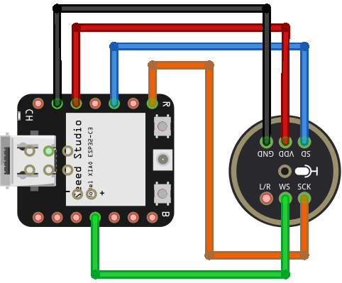

Room sound intensity meter
============

### What is this repository for?

* This repository was created to develop an ESP32-based ambient noise level meter, that can send alerts via instant messaging.

### Microcontroller info

* Model: Seeed Studio XIAO ESP32C3
* [Documentation page](https://wiki.seeedstudio.com/XIAO_ESP32C3_Getting_Started/)
* [Pinout diagram](https://files.seeedstudio.com/wiki/XIAO_WiFi/pin_map-2.png)
* [ESP32 datasheet](https://www.espressif.com/sites/default/files/documentation/esp32_datasheet_en.pdf)

### Microphone info

* Model: INMP441 I2S digital microphone
* [Datasheet](https://invensense.tdk.com/wp-content/uploads/2015/02/INMP441.pdf)

### How do I set up?

* Install Git
* Install Arduino IDE
* Follow these [instructions](https://wiki.seeedstudio.com/XIAO_ESP32C3_Getting_Started/#getting-started) to set up the XIAO ESP32 in the Arduino IDE
* Connect the components as shown in this diagram

* Clone this repo and upload `main.ino` to the ESP32

### Troubleshooting

#### The error `A fatal error occurred: No serial data received.` shows when trying to upload via Arduino IDE.

1. While holding the `B` button on the ESP32, press the `R` button.
1. Release the `R` button, and then `B`.
1. Re-upload the code.

#### The code was successfully uploaded, but the programmer is stuck in `Hard resetting via RTS pin...`.

- Press the `R` button once. The code should now be running.

### Contribution guidelines ###

* If you want to propose a change or need to modify the code for any reason first clone this [repository](https://github.com/DeltaLabo/rsim) to your PC and create a new branch for your changes. Once your changes are complete and fully tested ask the administrator permission to push this new branch into the source.
* If you just want to do local changes instead you can download a zip version of the repository and do all changes locally in your PC. 

### Who do I talk to? ###

* [Juan J. Rojas](mailto:juan.rojas@itcr.ac.cr)
